# Salesforce Sales Ops Portfolio

I'm Joe Pearson, a Salesforce Certified Administrator moving into Sales Ops and RevOps. I built this Salesforce Developer Edition org (Lightning) to show how I'd run Sales Ops for a sales team that gets paid on commission. It covers a Monday pipeline dashboard a sales leader can trust, split credit and quota math for each producer, exception reporting, and a policy data model with relationship SOQL. You can find me on [LinkedIn](https://www.linkedin.com/in/joe-pearson-Salesforce).

You don't need a login to look through it. I've documented everything below with screenshots, the SOQL I wrote, and the data model. The org holds demo data.

---

## The business I modeled

Gulf Coast GTM Co is a fictional independent commercial insurance brokerage on the Gulf Coast. I set it up with 144 client accounts across marinas, contractors, hospitality, healthcare, and property management. There are 428 opportunities, and on each one Amount is the estimated annual commission while Premium__c holds the written premium.

The coverage lines are Commercial Property, General Liability, Workers Comp, Cyber, and High-Net-Worth Personal Lines. Every opportunity is typed as New Business, Renewal, or Cross-sell. The sales team is 20 producers organized by Region and Team, and a lot of deals are shared between two or three of them.

I built everything around the questions a sales leader asks on Monday morning:

1. What does open pipeline look like by stage and by producer, and what closed recently?
2. Which deals are past due or stale, and who owns them?
3. How much credit does each producer actually earn when a deal is split?
4. Where is each producer against their 2026 plan, and is there enough pipeline to close the gap?

---

## Data model

Here's how the objects relate to each other.

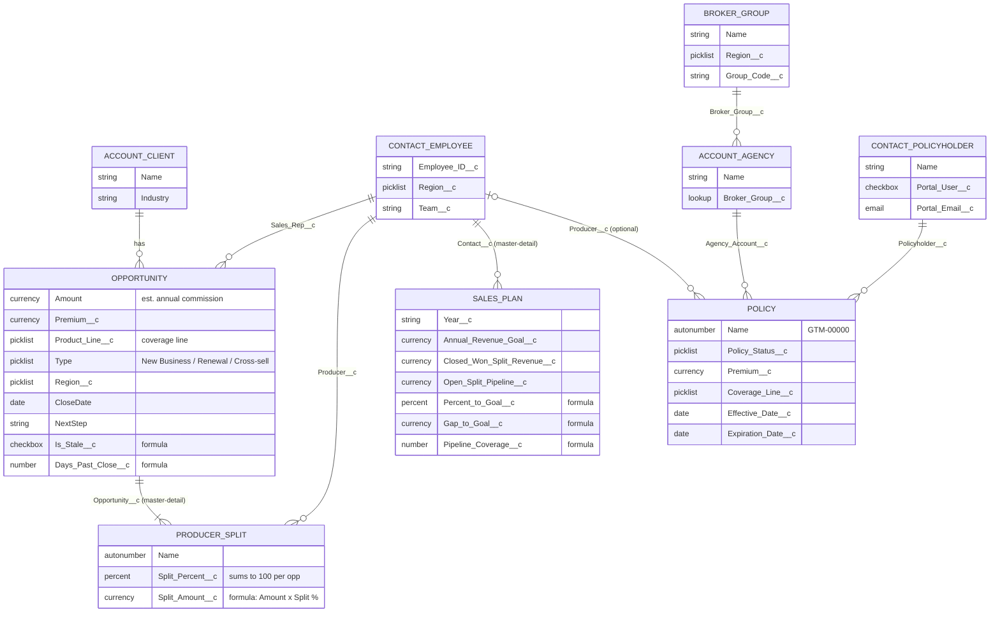

I used record types on Account and Contact so I could stay on standard objects wherever possible. On Account, the Client record type holds the insured businesses, which are the 144 client accounts. The Agency record type is the producing or retail agency, and each one sits under a Broker Group.

On Contact, I set up three record types. Client contacts are the buyers and influencers at client accounts. Employee contacts are the 20 producers, and they carry Region, Team, and Sales Plans. Policyholder contacts are the people tied to policies, and they have a portal flag.

I gave Client and Employee contacts their own Lightning record pages and layouts, assigned by record type. That way producer fields like Region, Team, and Sales Plans never show up on a client record, and client fields like buying role and relationship strength never show up on a producer.

---

## Why I built it this way

### I used custom Producer Splits instead of standard Opportunity Splits

Standard Opportunity Splits give credit to Salesforce Users through Opportunity Team membership. This org is a Developer Edition with only a handful of user licenses, and the sales team is 20 producers. Buying 20 seats just to hold split credit isn't realistic, and plenty of brokerages have producers who don't live in Salesforce every day.

So I made the producers Employee Contacts and put the splits in a custom object called Producer_Split__c. It's a master-detail to Opportunity with a lookup to an Employee Contact, and a lookup filter makes sure only the Employee record type can be picked. Each producer gets a Split_Percent__c, and Split_Amount__c is a formula that multiplies Amount by the split percent.

I loaded 643 split rows across the 428 opportunities. Some deals have a single producer at 100%, some are two-way at 60/40, and some are three-way at 50/30/20. Every opportunity's splits total exactly 100%, and closed-won split dollars equal closed-won Amount.

I think this is the better call for a brokerage. With standard splits, only active Users can receive credit, so 20 producers would mean 20 user licenses. With the custom object, any Employee Contact can get credit without a license, and it costs nothing extra. Standard splits come with their own split report types, while mine uses a standard custom report type that groups by producer and feeds the Sales Plan actuals. Standard splits were built for internal sales teams, and the custom object matches the way producers share commission on a placement.

### Quota credit is the split share

Sales Plan actuals (Closed_Won_Split_Revenue__c and Open_Split_Pipeline__c) roll up from Producer_Split__c and never from the full opportunity Amount. A $30K commission deal split 50/30/20 credits $15K, $9K, and $6K. Nobody gets double-counted, and the team total ties back to closed-won Amount.

### Amount is commission, and premium is kept separate

For a brokerage, the revenue that matters to the firm is commission, not premium. I put estimated annual commission in Amount so every standard pipeline and forecast report reads in the firm's revenue. I kept Premium__c on all 428 opportunities for carrier and account conversations.

### Sales Rep sits on the opportunity instead of Owner

Opportunity Owner has to be a User, and my producers aren't Users. So I added Sales_Rep__c, a lookup to Employee Contact filtered to the Employee record type, and it carries the producer on every pipeline, exception, and stale report. Region is stamped from the producer, so the Region filter on the dashboard follows the producer's book.

### Exceptions are formulas, not manual flags

Days_Past_Close__c, Has_Next_Step__c, and Is_Stale__c are all formulas. Is_Stale__c flags an open deal that's past its close date, is missing a next step, or hasn't had its next step updated in 14 or more days. Because they're formulas, the exception lists stay current without anyone having to maintain them.

### The policy hierarchy is separate from the sales pipeline

Broker groups own agency accounts, agency accounts write policies, and each policy links to a policyholder contact. I kept that in-force book apart from the new-business pipeline on purpose. I also used standard objects wherever I could, with Account and Contact record types, so the hierarchy works with standard reporting and portal patterns.

---

## Dashboards

### Sales Team Dashboard

This is the dashboard I built for leadership to use in the Monday pipeline meeting. I put a row of KPI tiles across the top so a leader gets the headline numbers before reading a single chart. When I took this screenshot, the tiles showed Premium Written This Year at $80M, New Business This Year at $1.6M, Cross-sell This Year at $3.6M, Renewals Due Next 90 at $4.2M, Win Rate This Year at 65.1%, Stale Deals at 175, Open Pipeline at $14M, and Past Due Deals at 53. Each tile links to the report behind it.

Below the tiles, the dashboard shows open pipeline by stage and by rep, closed won for the last 30 days, this month, and year to date, and open pipeline and closed won by line of business. A manager can filter by Close Date (Last 30 Days, This Month, This Year, Next 30, or Next 90) and by Region to narrow it down to one book.

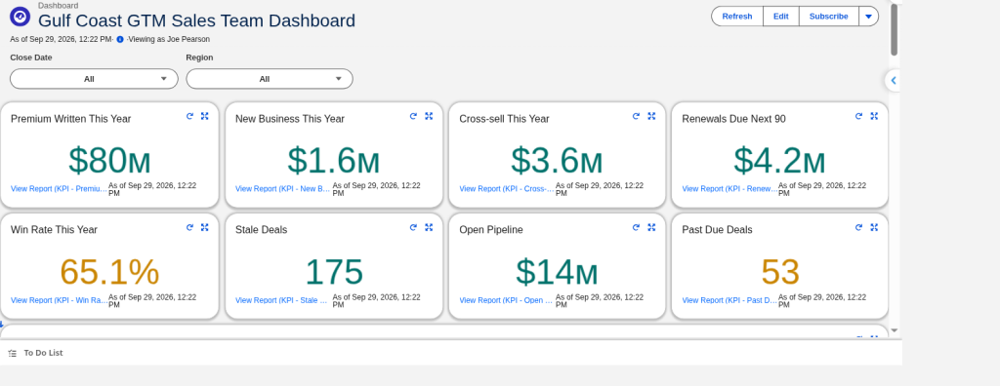
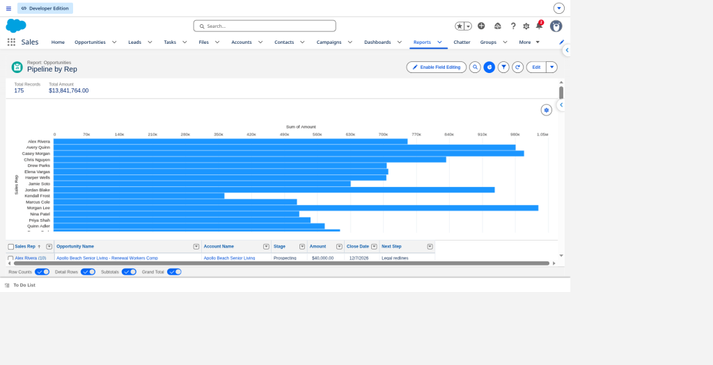

Further down is the "Stuck: Past Due Open Opps" table, which lists the open opportunities that are past their close date with the Opportunity, Account, Sales Rep, Stage, and Amount on each row. The report behind it adds Close Date and Next Step. It's the table a leader opens when they don't trust the forecast, because it shows exactly which deals are slipping and who owns them.

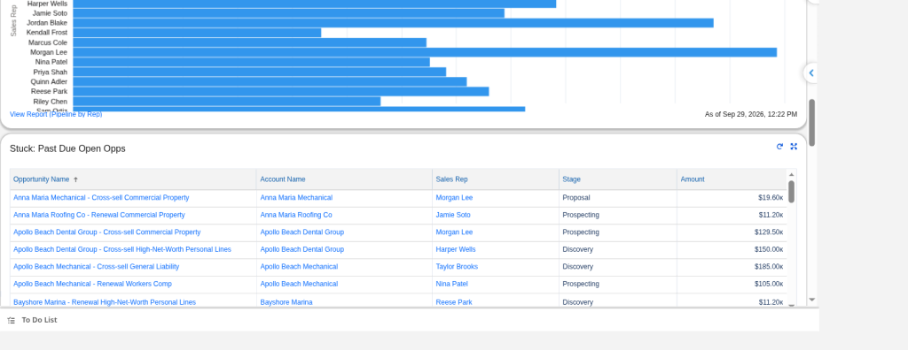

### Producer Dashboard

I built this one for producer economics and coaching. It opens with eight KPI tiles for Closed Won This Year, Open Pipeline, Open Next 30, Open Next 90, Win Rate This Year, Average Deal Size, Stale Deals, and Team % to Goal. Below the tiles, it shows open pipeline by producer at the split amount, closed won splits by producer year to date, the stuck opportunities that Is Stale flags, and each producer's Sales Plan percent to goal.

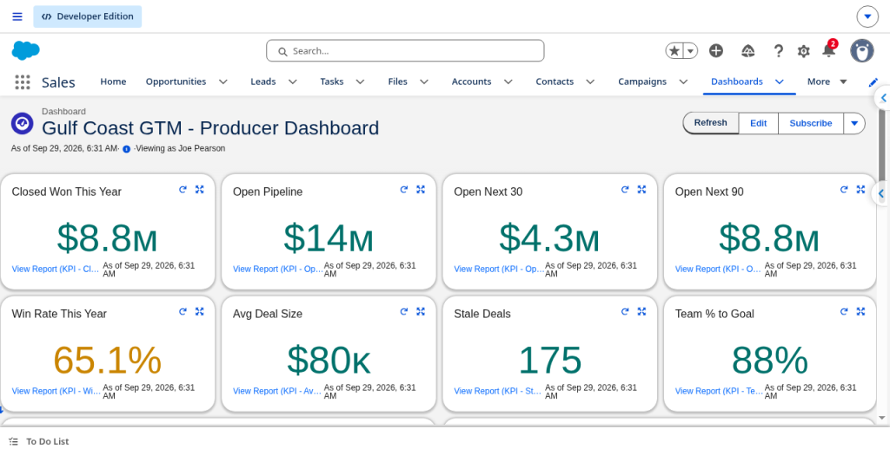
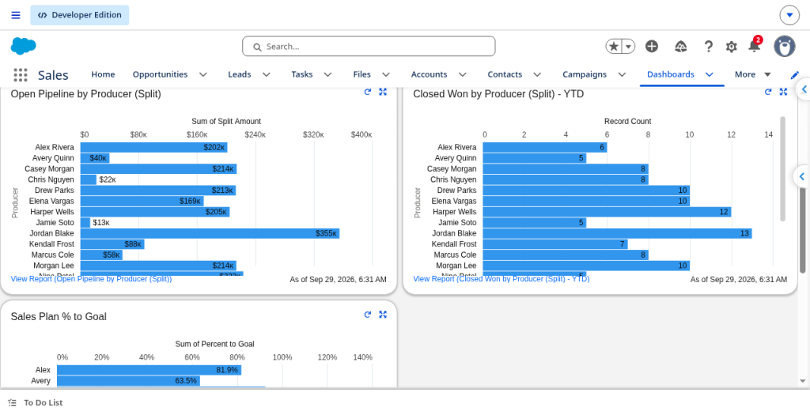
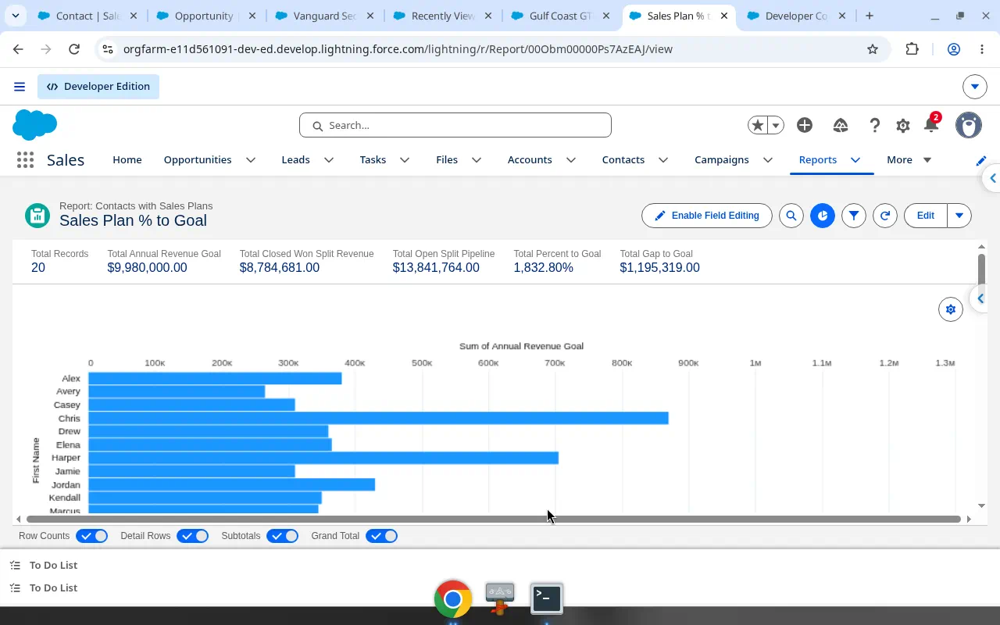
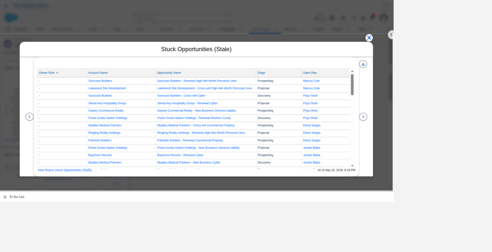

### Producer Home

I set the Producer Dashboard as the Home page of the Sales app, so the KPI tiles are the first thing anyone sees when they open the app. Further down the Home page, I added opportunity list views for recent closed won deals and open opportunities, with the Sales Rep on every row.

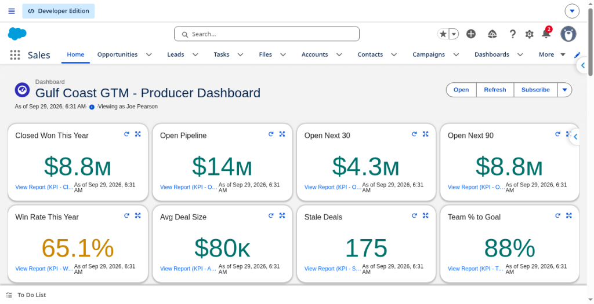
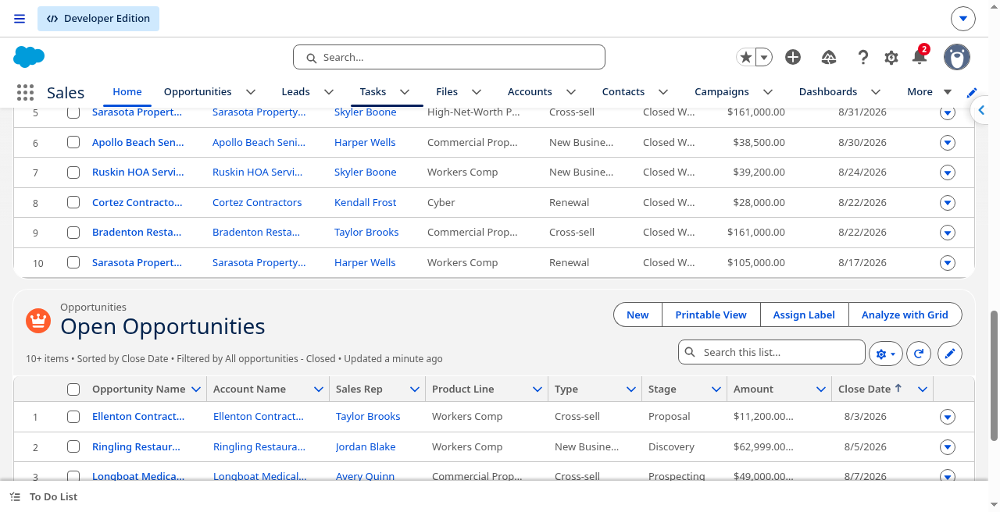

### Rep Performance tab

The 20 reps are Employee Contacts, so I gave the Employee Contact record page a Performance tab. It starts with a % to Goal chart from the rep's Sales Plan, and below that it lists the rep's open pipeline, closed won deals, stale deals, and split credit. A manager can open any rep and have the whole coaching conversation from one page.

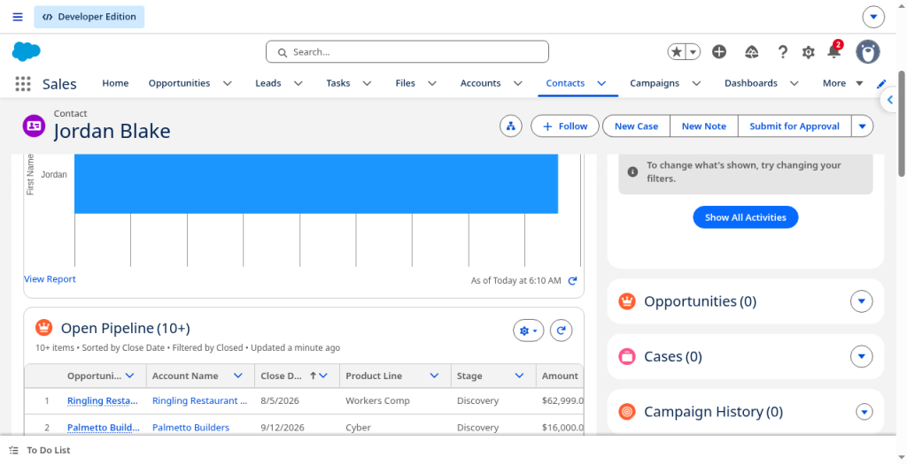
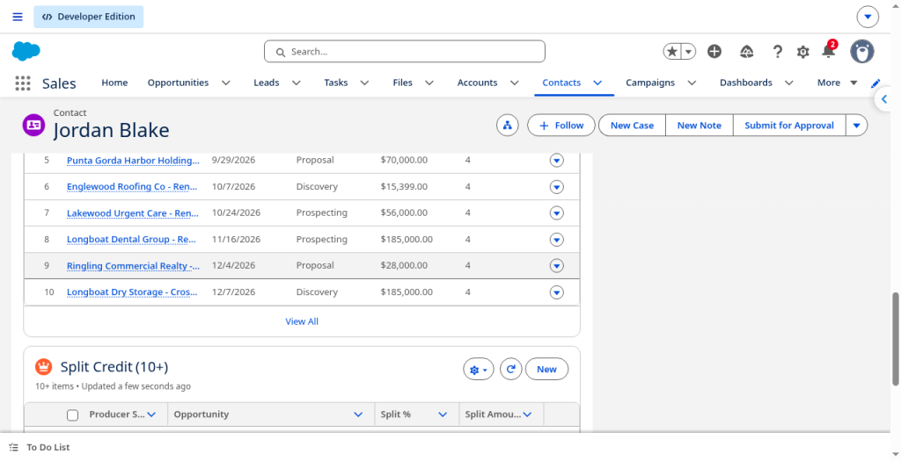

### Split credit and Deal Amount

I added a Deal Amount field to Producer Split that shows the full opportunity Amount next to the rep's Split % and Split Amount. That way anyone reading the Split Credit list sees the whole deal, the rep's share, and the credit that share earns on the same row, and they can check the math without opening the opportunity.

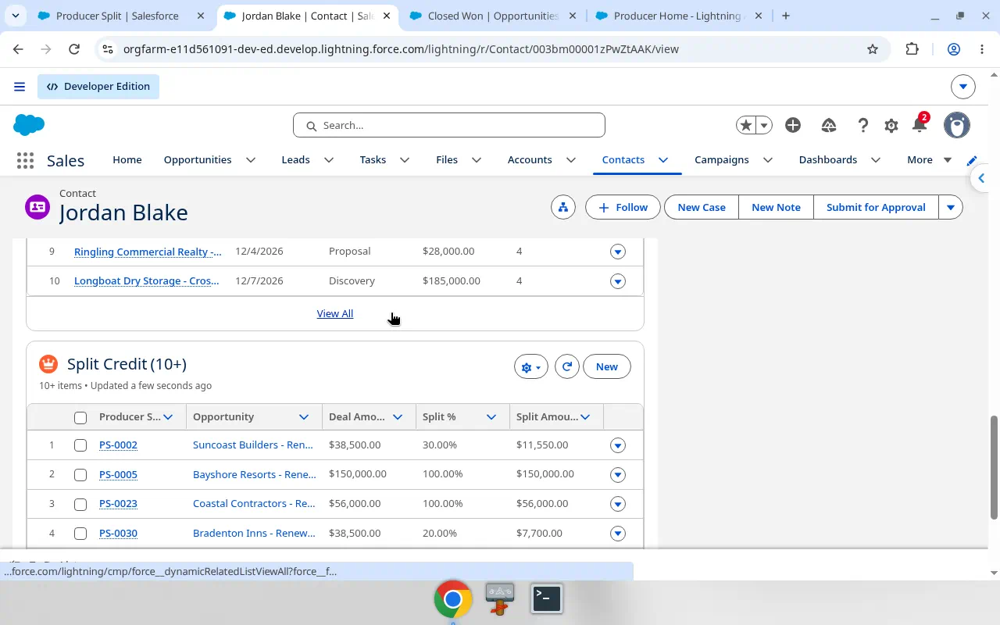

### Records

These are the record pages that back up the dashboards.

- This is an opportunity with its Producer Splits related list. 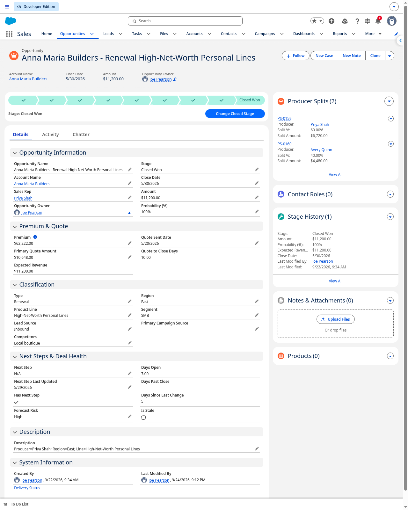
- This is an Employee Contact with the 2026 Sales Plan in its related list. 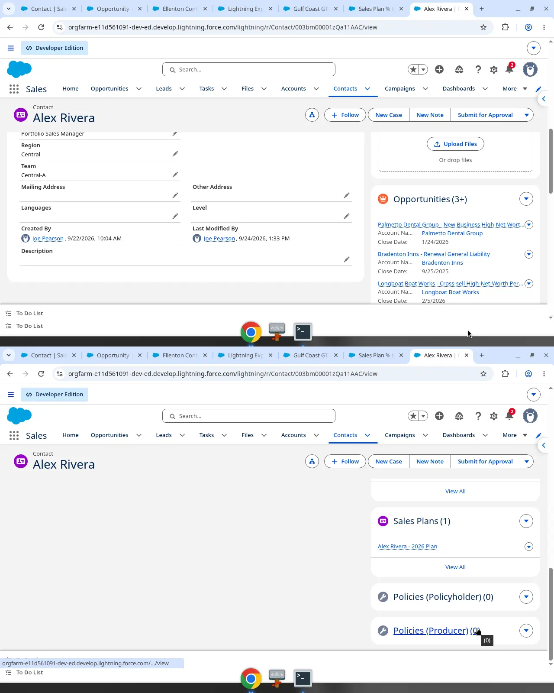
- This is a single Sales Plan record. 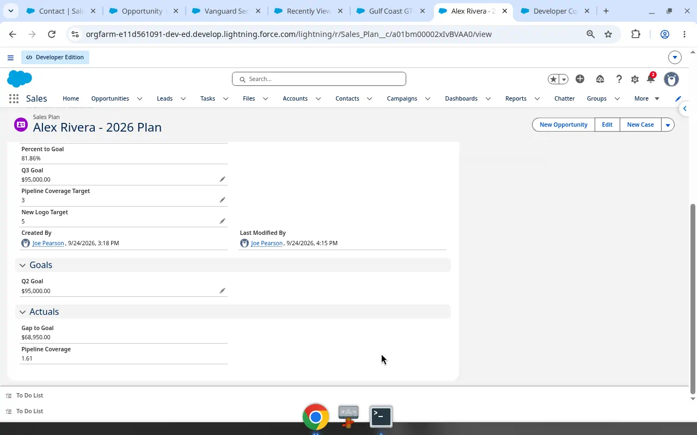
- This is the Policies list view. 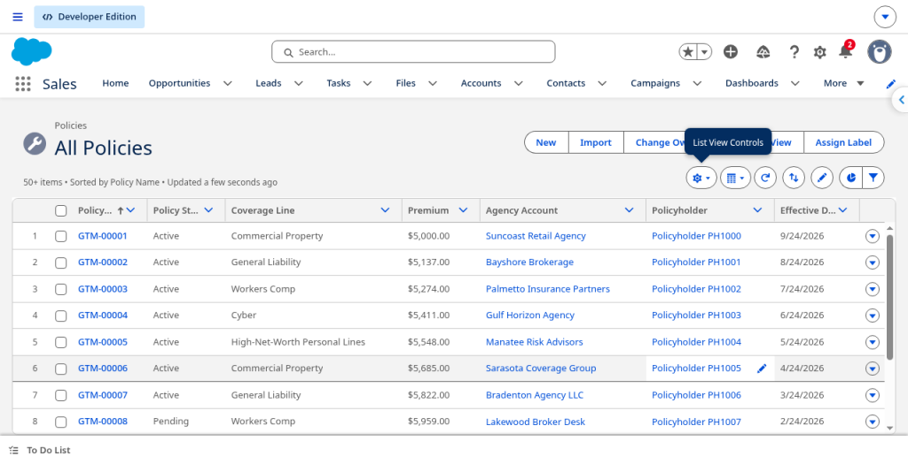

---

## Sales Plans

Sales_Plan__c is a master-detail to Employee Contact, and I set up 20 plans for 2026, one for each producer. Each plan has an Annual_Revenue_Goal__c set per producer, along with quarterly goals for Q1 through Q4.

The actuals come from the splits. Closed_Won_Split_Revenue__c is the sum of the producer's closed-won Split_Amount__c, and Open_Split_Pipeline__c is the sum of their open Split_Amount__c.

From there, three formulas do the math. Percent_to_Goal__c divides closed-won split revenue by the annual goal. Gap_to_Goal__c subtracts closed-won split revenue from the annual goal. Pipeline_Coverage__c divides open split pipeline by the annual goal. That gives a manager the coaching conversation: who's short, and whether there's enough pipeline to close it.

---

## SOQL samples

The dashboards and reports in this org are all standard Salesforce reports. I use SOQL for ad hoc questions that a standard report can't answer, such as walking the policy hierarchy across several objects. All of my queries are in [`soql/`](soql/), and each one answers a question I'd expect a sales leader or ops team to ask.

- [`01-stale-open-opps.soql`](soql/01-stale-open-opps.soql) finds open opportunities that are past their close date.
- [`02-missing-next-step.soql`](soql/02-missing-next-step.soql) finds open opportunities with no next step.
- [`03-pipeline-by-stage.soql`](soql/03-pipeline-by-stage.soql) is an aggregate query that returns open pipeline count and Amount by stage.
- [`04-stuck-close-date-le-today.soql`](soql/04-stuck-close-date-le-today.soql) finds stuck deals that are open with a close date of today or earlier, along with their stale flags.
- [`05-quote-to-close-won.soql`](soql/05-quote-to-close-won.soql) shows the days from quote to close on won deals.
- [`06-no-recent-activity-hint.soql`](soql/06-no-recent-activity-hint.soql) finds open deals with no activity in the last 14 days.
- [`07-portal-customers-active-policies.soql`](soql/07-portal-customers-active-policies.soql) lists portal policyholders by broker group and agency by walking from Policy to Agency to Broker Group and from Policy to Policyholder, and the compact version returns 80 rows.
- [`08-producer-split-credit.soql`](soql/08-producer-split-credit.soql) totals won producer split credit by producer for the current fiscal year.

Here's SOQL 07 running in the Developer Console.

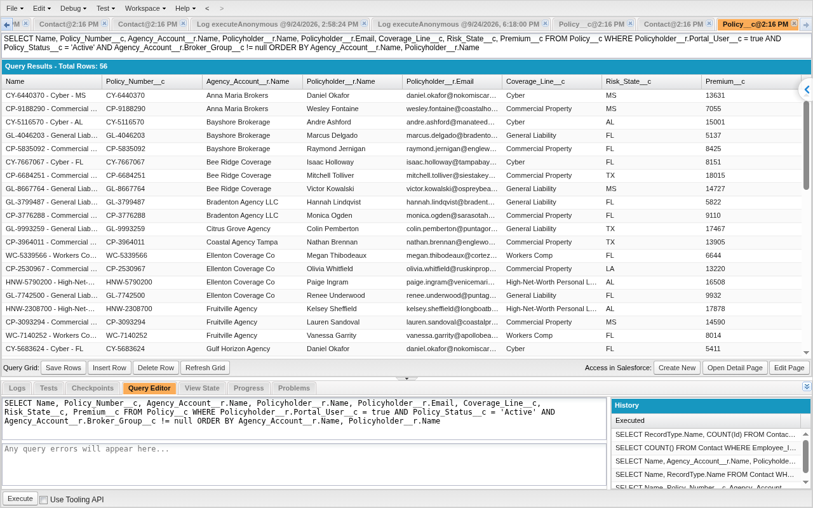

---

## Data samples

The [`data-samples/`](data-samples/) folder has small CSV slices of Accounts, Opportunities, and Leads so you can see the shape of the fields.
