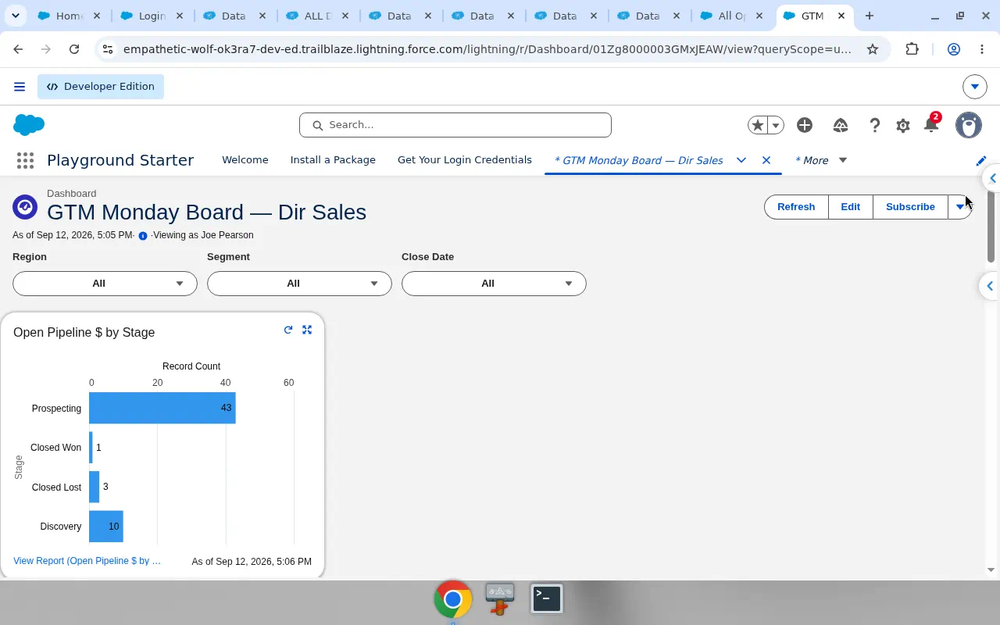
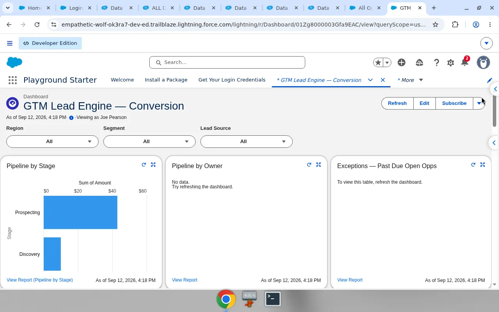

# Gulf Coast GTM Co

Personal Salesforce playground I use to practice Sales Ops work — pipeline hygiene, director-facing dashboards, lead conversion, and the SOQL I’d run in Inspector on a real book.

I’m Joe Pearson. Day job is Salesforce / ops in P&C. This is not a client org and the companies are fake. It’s a place to show how I’d keep a forecast honest.

**Playground name:** Gulf Coast GTM Co  
**LinkedIn:** [joe-pearson-Salesforce](https://www.linkedin.com/in/joe-pearson-Salesforce)

## What’s loaded

- 143 accounts with names that look like real Gulf / Southeast businesses
- 428 opportunities across Prospecting → Closed Won/Lost, owned by five reps
- Region, Segment, product line, forecast risk, quote dates, and a few formulas (days open, past close, stale, quote-to-close)
- Leads with a converted subset so conversion reports aren’t empty
- Two Lightning dashboards with filters

Reps in the org: Marcus Cole, Priya Shah, Elena Vargas, Jordan Blake, Avery Quinn (playground license limit stopped at five).

## Dashboards

**GTM Monday Board — Dir Sales**  
Filters: Region, Segment, Close Date.  
Open pipeline by stage and by rep, hygiene for past-due / missing next step, won dollars over the trailing year, quote-to-close on wins. The point is a Monday view a sales director would actually click.

**GTM Lead Engine — Conversion**  
Filters: Region, Segment, Lead Source.  
Status, source, rep, converted vs open — volume without conversion doesn’t count.

## SOQL

Files in [`soql/`](soql/). Same questions as the hygiene reports: open deals past close date, missing next step, pipeline by stage, quote-to-close on won deals, and (once activities exist) no touch in 14 days.

## Loom (when I record it)

Ninety seconds: dirty forecast problem → filter the Monday board → open the stuck list → same exception in Inspector → lead conversion by source.

## Samples

[`data-samples/`](data-samples/) has small CSV slices so you can see field shape. The full dataset lives in the playground.

## Still building

- Logged emails / calls / tasks on opportunities (so Last Activity means something)
- Stuck opps report: open and Close Date on or before today
- Loss reason and original close date / push count
- Notes on high-risk deals

## Note

Fictional company names. Synthetic data. Don’t treat screenshots as production metrics.
